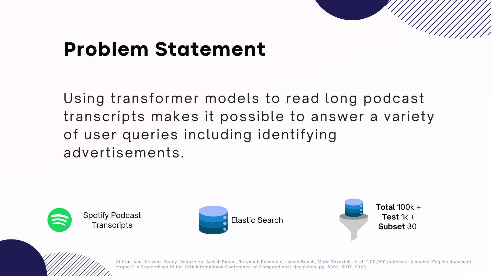
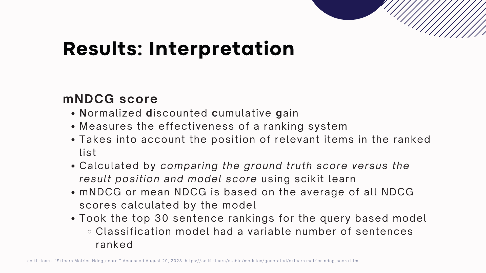
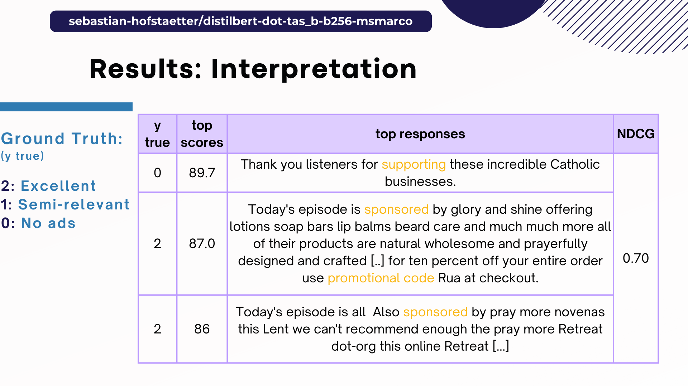
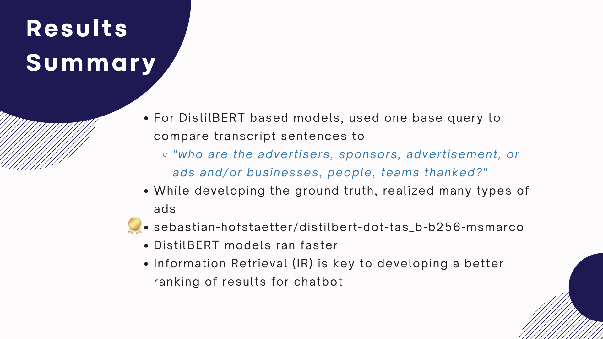
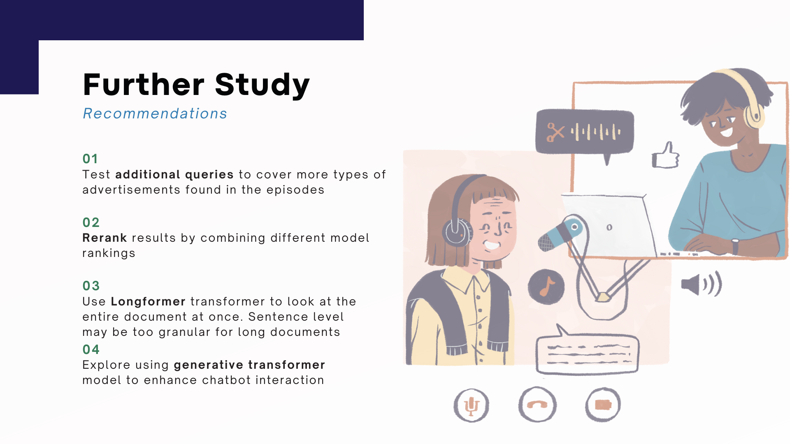
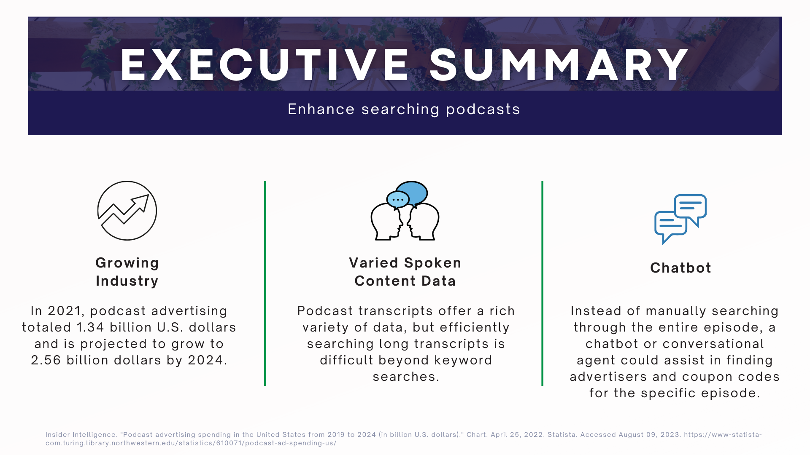
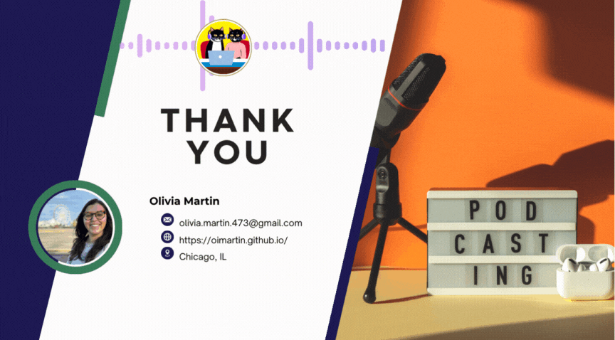

 </img>

<i>📝Full report can be found [here](OliviaMartin-Report-Extracting_Advertisements_in_Spotify_Podcast_Transcripts_using_Transformer_Models_in_Task_Oriented_Chatbot.pdf)</i>
 
<i>🎥Full video presentation can be found [here](https://northwestern.hosted.panopto.com/Panopto/Pages/Viewer.aspx?id=96f4b5e2-52b7-4137-86f8-b06500220468)</i>
 
 
 </img>

 </img>

 </img>

 </img>

 </img>

 
 

